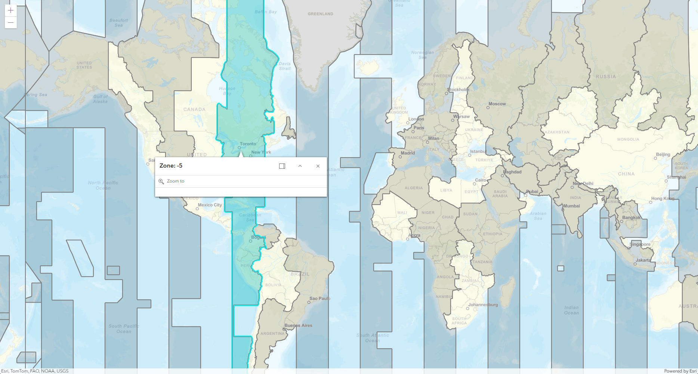

# Time Zone Finder

This project uses ArcGIS Maps SDK for JavaScript. 

World_Time_Zones feature layer is loaded from ArcGIS REST Services Directory onto the map view to allow identification of global Time Zones.

View on browser: https://glowiep.github.io/esri-js-time-zone-finder/

## Sources
- <a href="https://developers.arcgis.com/javascript/latest/">ArcGIS Maps SDK for JavaScript</a>
- ArcGIS REST Services Directory: <a href="https://services.arcgis.com/P3ePLMYs2RVChkJx/ArcGIS/rest/services/World_Time_Zones/FeatureServer/0">World_Time_Zones feature layer</a>
